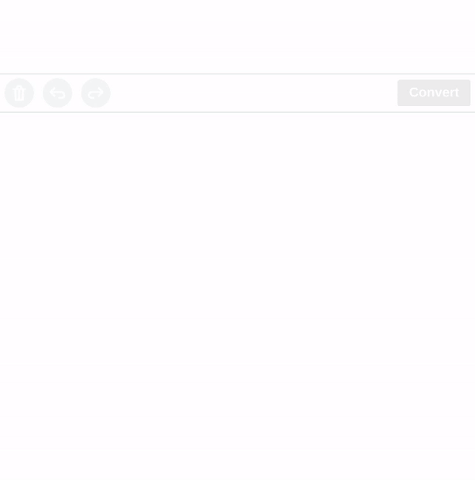

# myscript-math-web

The easy way to integrate mathematical expressions handwriting recognition in your web app.



```html
<html>
<head>
    <script src="bower_components/webcomponentsjs/webcomponents-lite.js"></script>
    <link rel="import" href="bower_components/myscript-math-web/myscript-math-web.html">
</head>
<body>
    <myscript-math-web 
        applicationkey="#PUT YOUR MYSCRIPT CDK APPLICATION KEY HERE#" 
        hmackey="#PUT YOUR MYSCRIPT CDK HMAC KEY HERE#">
    </myscript-math-web>
</body>
</html>
```    

[Test it live](https://myscript.github.io/myscript-math-web/components/myscript-math-web/demo/)!

## What is it about?

myscript-math-web is a web component that can be used in every web application (whatever the JavaScript library you are using) to bring handwriting recognition. It integrates all you need:  
* Signal capture,
* Nice digital ink rendering,
* Plug with MyScript CDK to bring handwriting recognition.

## Installation

**Bower**: `bower install myscript-math-web`

## Start using myscript-math-web

1. Create an account on the [Developer portal](https://developer.myscript.com/), which will allow you to generate an application key and HMAC key.  

2. Import Web Components' polyfill

    `<script src="bower_components/webcomponentsjs/webcomponents-lite.js"></script>`

3. Import Custom Element

    `<link rel="import" href="bower_components/myscript-math-web/myscript-math-web.html">`

3. Use it

    `<myscript-math-web applicationkey="#PUT YOUR MYSCRIPT CDK APPLICATION KEY HERE#" hmackey="#PUT YOUR MYSCRIPT CDK HMAC KEY HERE#"></myscript-math-web>`

## Documentation 

The API Reference is available here: [https://myscript.github.io/myscript-math-web/](https://myscript.github.io/myscript-math-web/) 

## Contribute

If you wish to contribute to myscript-math-web, feel free to fork it!
Please sign our [Contributor License Agreement](CONTRIBUTING.md) before submitting your pull request.

## Share your feedback

Made a cool app with myscript-math-web? We would love to hear about you!
We’re planning to showcase apps using it so let us know by sending a quick mail to [myapp@myscript.com](mailto://myapp@myscript.com)
